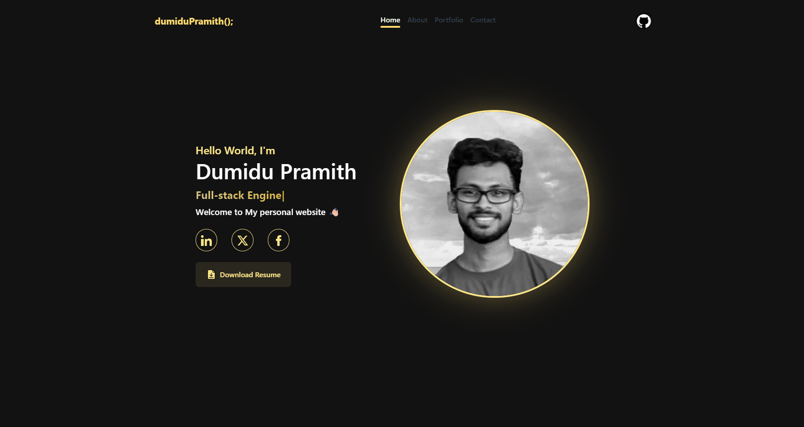

<h2 align="center">
  Portfolio Website 
  <a href="https://dumidupramith.netlify.app/" target="_blank">DumiduPramith</a>
</h2>

  

 

 &nbsp;
 &nbsp;

## Built With

My personal portfolio <a href="https://dumidupramith.netlify.app/" target="_blank">DumiduPramith</a> which features some of my github projects as well as my resume and technical skills. 

This project was built using these technologies.

- Angularjs
- Bootstrap4
- VsCode

## Features

**📖 Multi-Page Layout**

**🎨 Styled with AngularAnimations-Bootstrap and Css with easy to customize colors**

**📱 Fully Responsive**

## Getting Started

## 🛠 Installation and Setup Instructions

1. Installation: `Clone The repository`

2. Put Project into webserver`(Apache,nginx)`, in there you can direcly serve the html and static files.

## Github Repo - <a href="https://github.com/DumiduPramith/portfolio" target="_blank">https://github.com/DumiduPramith/portfolio</a>
